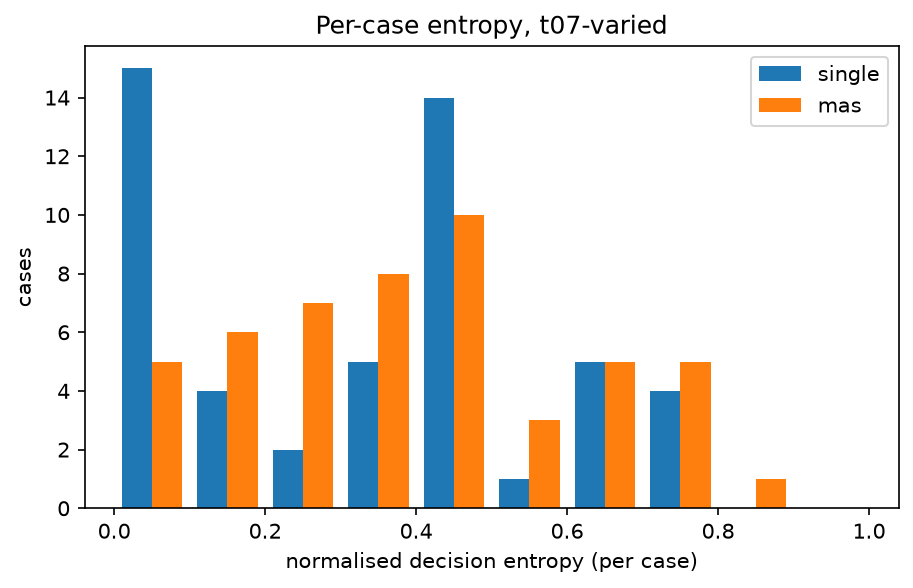
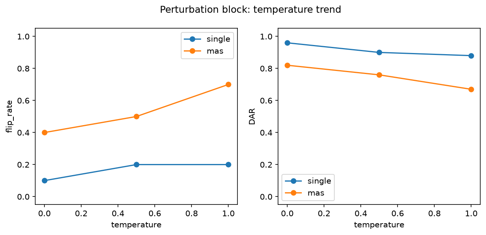

# Analysis report — PRD-A repeatability experiment

Model `deepseek-r1:14b` (c333b7232bdb5212366…), Ollama 0.32.9, config hash `0adb076dd556`.
Journal lines: single=1150, mas=1150; planned total 2300.

pass^k is agreement with the benchmark authors' labels, not 'correctness'. Malformed outputs are included in every metric as an outcome category: they never match a label (pass^k, majority vote) and never match a real decision, but two malformed outputs count as agreeing with each other in DAR/alpha/entropy (category equality). Majority-vote ties break by canonical outcome order (escalate > dismiss > investigate > malformed).

## Headline: Tier 1 (primary conditions)

| arm | condition | cases | repeats | pass^1 | pass^5 | pass^15 | DAR | krippendorff_alpha | flip_rate |
|---|---|---|---|---|---|---|---|---|---|
| single | t0-fixed | 50 | 5 | 0.616 | 0.520 | — | 0.928 | 0.875 | 0.180 |
| single | t07-varied | 50 | 15 | 0.628 | 0.377 | 0.300 | 0.684 | 0.425 | 0.700 |
| mas | t0-fixed | 50 | 5 | 0.596 | 0.460 | — | 0.866 | 0.740 | 0.300 |
| mas | t07-varied | 50 | 15 | 0.571 | 0.267 | 0.100 | 0.633 | 0.304 | 0.900 |

## Tier 2

| arm | condition | cases | repeats | majority_vote_accuracy | mean_entropy | TAR | jaccard | nLCS | malformed_rate |
|---|---|---|---|---|---|---|---|---|---|
| single | t0-fixed | 50 | 5 | 0.620 | 0.065 | 1.000 | 1.000 | 1.000 | 0.000 |
| single | t07-varied | 50 | 15 | 0.640 | 0.332 | 1.000 | 1.000 | 1.000 | 0.001 |
| mas | t0-fixed | 50 | 5 | 0.600 | 0.120 | 1.000 | 1.000 | 1.000 | 0.000 |
| mas | t07-varied | 50 | 15 | 0.600 | 0.402 | 1.000 | 1.000 | 1.000 | 0.003 |

## Cost (Tier 3)

| arm | condition | cases | repeats | tokens_per_run | tokens_per_pass^1 | tokens_per_pass^5 | tokens_per_pass^15 | mean_wall_clock_s |
|---|---|---|---|---|---|---|---|---|
| single | t0-fixed | 50 | 5 | 1049.508 | 1703.747 | 2018.285 | — | 12.562 |
| single | t07-varied | 50 | 15 | 1009.400 | 1607.325 | 2675.447 | 3364.667 | 11.805 |
| mas | t0-fixed | 50 | 5 | 4961.608 | 8324.846 | 10786.104 | — | 52.410 |
| mas | t07-varied | 50 | 15 | 5041.627 | 8834.626 | 18913.658 | 50416.267 | 29.728 |

## Perturbation block (instrument check)

| arm | condition | cases | repeats | pass^1 | pass^5 | pass^15 | DAR | krippendorff_alpha | flip_rate | mean_entropy |
|---|---|---|---|---|---|---|---|---|---|---|
| single | pert-t0 | 10 | 5 | 0.880 | 0.800 | — | 0.960 | 0.909 | 0.100 | 0.036 |
| single | pert-t05 | 10 | 5 | 0.780 | 0.700 | — | 0.900 | 0.814 | 0.200 | 0.085 |
| single | pert-t10 | 10 | 5 | 0.800 | 0.700 | — | 0.880 | 0.776 | 0.200 | 0.112 |
| mas | pert-t0 | 10 | 5 | 0.720 | 0.500 | — | 0.820 | 0.664 | 0.400 | 0.157 |
| mas | pert-t05 | 10 | 5 | 0.700 | 0.400 | — | 0.760 | 0.566 | 0.500 | 0.205 |
| mas | pert-t10 | 10 | 5 | 0.700 | 0.300 | — | 0.670 | 0.405 | 0.700 | 0.298 |

## Appendix: lexical consistency (ROUGE-L)

| arm | condition | cases | repeats | rouge_l_f1 |
|---|---|---|---|---|
| single | t0-fixed | 50 | 5 | 0.779 |
| single | t07-varied | 50 | 15 | 0.312 |
| single | pert-t0 | 10 | 5 | 0.740 |
| single | pert-t05 | 10 | 5 | 0.353 |
| single | pert-t10 | 10 | 5 | 0.269 |
| mas | t0-fixed | 50 | 5 | 0.537 |
| mas | t07-varied | 50 | 15 | 0.294 |
| mas | pert-t0 | 10 | 5 | 0.453 |
| mas | pert-t05 | 10 | 5 | 0.299 |
| mas | pert-t10 | 10 | 5 | 0.214 |

rouge_l_f1 is the mean pairwise ROUGE-L F1 of the FULL raw output text across repeats (lowercased, whitespace tokens): surface-form overlap only, distinct from the decision-level and trajectory-level metrics above, and never part of the Tier 1 winner criterion.

## Arm difference (single − mas), t07-varied, per-case paired

| metric | mean diff | bootstrap 95% CI | permutation p |
|---|---|---|---|
| pass_fraction | 0.057 | [0.011, 0.107] | 0.024 |
| DAR | 0.051 | [0.007, 0.096] | 0.029 |
| entropy | -0.069 | [-0.119, -0.021] | 0.007 |

Worst-entropy cases (single, t07-varied): TXN-2025-004, TXN-2025-029, TXN-2025-043
Worst-entropy cases (mas, t07-varied): TXN-2025-039, TXN-2025-049, TXN-2025-004

## Figures

