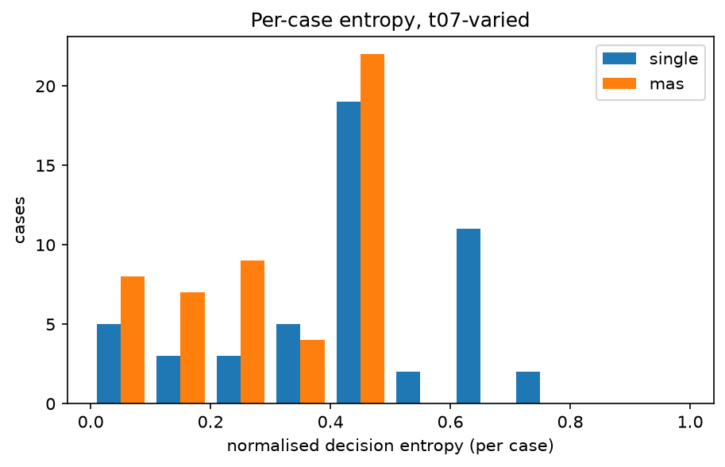
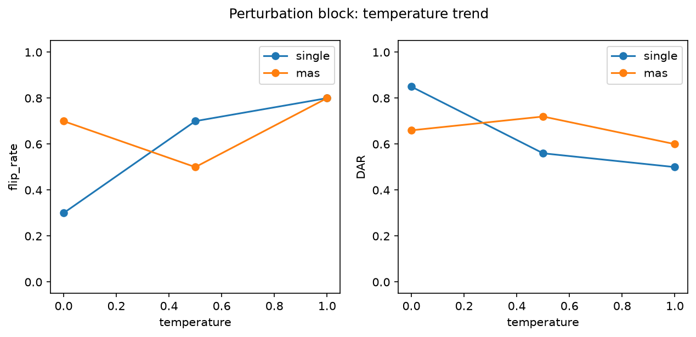

# Analysis report — PRD-A repeatability experiment

Model `gemma4:latest` (c6eb396dbd5992bbe3f…), Ollama 0.32.6, config hash `830300248a6b`.
Journal lines: single=1150, mas=1150; planned total 2300.

pass^k is agreement with the benchmark authors' labels, not 'correctness'. Malformed outputs are included in every metric as an outcome category: they never match a label (pass^k, majority vote) and never match a real decision, but two malformed outputs count as agreeing with each other in DAR/alpha/entropy (category equality). Majority-vote ties break by first-observed decision.

## Headline: Tier 1 (primary conditions)

| arm | condition | cases | repeats | pass^1 | pass^5 | pass^15 | DAR | krippendorff_alpha | flip_rate |
|---|---|---|---|---|---|---|---|---|---|
| single | t0-fixed | 50 | 5 | 0.648 | 0.520 | — | 0.880 | 0.819 | 0.300 |
| single | t07-varied | 50 | 15 | 0.552 | 0.185 | 0.080 | 0.594 | 0.387 | 0.900 |
| mas | t0-fixed | 50 | 5 | 0.312 | 0.240 | — | 0.804 | 0.609 | 0.400 |
| mas | t07-varied | 50 | 15 | 0.297 | 0.113 | 0.040 | 0.705 | 0.406 | 0.840 |

## Tier 2

| arm | condition | cases | repeats | majority_vote_accuracy | mean_entropy | TAR | jaccard | nLCS | malformed_rate |
|---|---|---|---|---|---|---|---|---|---|
| single | t0-fixed | 50 | 5 | 0.640 | 0.108 | 0.756 | 0.869 | 0.861 | 0.000 |
| single | t07-varied | 50 | 15 | 0.600 | 0.430 | 0.150 | 0.520 | 0.506 | 0.013 |
| mas | t0-fixed | 50 | 5 | 0.300 | 0.167 | 0.872 | 0.998 | 0.974 | 0.000 |
| mas | t07-varied | 50 | 15 | 0.320 | 0.304 | 0.352 | 0.989 | 0.864 | 0.000 |

## Cost (Tier 3)

| arm | condition | cases | repeats | tokens_per_run | tokens_per_pass^1 | tokens_per_pass^5 | tokens_per_pass^15 | mean_wall_clock_s |
|---|---|---|---|---|---|---|---|---|
| single | t0-fixed | 50 | 5 | 3663.100 | 5652.932 | 7044.423 | — | 17.362 |
| single | t07-varied | 50 | 15 | 3931.435 | 7122.164 | 21224.065 | 49142.933 | 18.738 |
| mas | t0-fixed | 50 | 5 | 8952.672 | 28694.462 | 37302.800 | — | 50.847 |
| mas | t07-varied | 50 | 15 | 9491.080 | 31920.673 | 83680.896 | 237277.000 | 42.870 |

## Perturbation block (instrument check)

| arm | condition | cases | repeats | pass^1 | pass^5 | pass^15 | DAR | krippendorff_alpha | flip_rate | mean_entropy |
|---|---|---|---|---|---|---|---|---|---|---|
| single | pert-t0 | 10 | 5 | 0.680 | 0.500 | — | 0.850 | 0.748 | 0.300 | 0.141 |
| single | pert-t05 | 10 | 5 | 0.560 | 0.300 | — | 0.560 | 0.295 | 0.700 | 0.395 |
| single | pert-t10 | 10 | 5 | 0.560 | 0.200 | — | 0.500 | 0.258 | 0.800 | 0.443 |
| mas | pert-t0 | 10 | 5 | 0.320 | 0.200 | — | 0.660 | 0.324 | 0.700 | 0.290 |
| mas | pert-t05 | 10 | 5 | 0.260 | 0.100 | — | 0.720 | 0.428 | 0.500 | 0.230 |
| mas | pert-t10 | 10 | 5 | 0.280 | 0.000 | — | 0.600 | 0.216 | 0.800 | 0.339 |

## Appendix: lexical consistency (ROUGE-L)

| arm | condition | cases | repeats | rouge_l_f1 |
|---|---|---|---|---|
| single | t0-fixed | 50 | 5 | 0.702 |
| single | t07-varied | 50 | 15 | 0.237 |
| single | pert-t0 | 10 | 5 | 0.638 |
| single | pert-t05 | 10 | 5 | 0.268 |
| single | pert-t10 | 10 | 5 | 0.203 |
| mas | t0-fixed | 50 | 5 | 0.387 |
| mas | t07-varied | 50 | 15 | 0.291 |
| mas | pert-t0 | 10 | 5 | 0.372 |
| mas | pert-t05 | 10 | 5 | 0.318 |
| mas | pert-t10 | 10 | 5 | 0.262 |

rouge_l_f1 is the mean pairwise ROUGE-L F1 of the FULL raw output text across repeats (lowercased, whitespace tokens): surface-form overlap only, distinct from the decision-level and trajectory-level metrics above, and never part of the Tier 1 winner criterion.

## Arm difference (single − mas), t07-varied, per-case paired

| metric | mean diff | bootstrap 95% CI | permutation p |
|---|---|---|---|
| pass_fraction | 0.255 | [0.164, 0.345] | 0.000 |
| DAR | -0.110 | [-0.186, -0.033] | 0.011 |
| entropy | 0.126 | [0.051, 0.199] | 0.003 |

Worst-entropy cases (single, t07-varied): TXN-2025-022, TXN-2025-007, TXN-2025-001
Worst-entropy cases (mas, t07-varied): TXN-2025-001, TXN-2025-013, TXN-2025-016

## Figures

