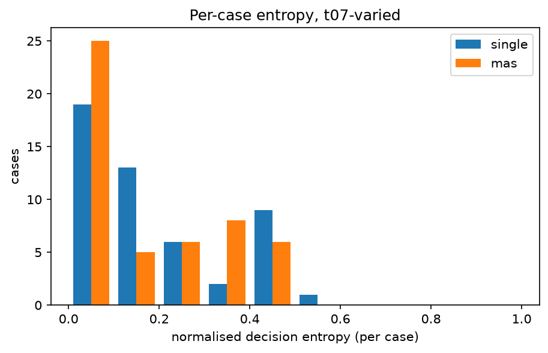
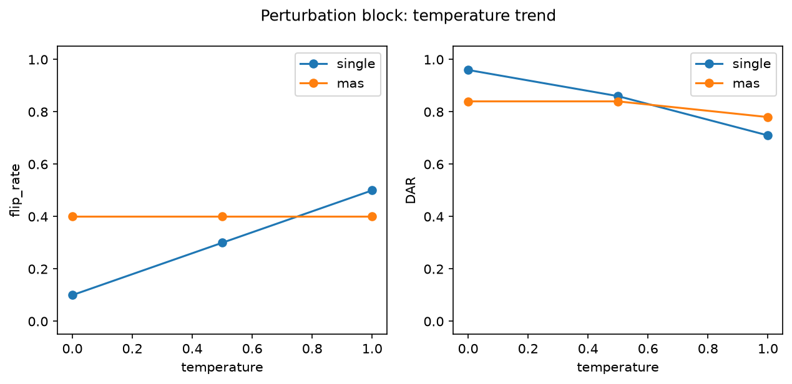

# Analysis report — PRD-A repeatability experiment

Model `granite4.1:8b` (444af1c4b2fedd6b540…), Ollama 0.32.9, config hash `c3658d08da83`.
Journal lines: single=1150, mas=1150; planned total 2300.

pass^k is agreement with the benchmark authors' labels, not 'correctness'. Malformed outputs are included in every metric as an outcome category: they never match a label (pass^k, majority vote) and never match a real decision, but two malformed outputs count as agreeing with each other in DAR/alpha/entropy (category equality). Majority-vote ties break by canonical outcome order (escalate > dismiss > investigate > malformed).

## Headline: Tier 1 (primary conditions)

| arm | condition | cases | repeats | pass^1 | pass^5 | pass^15 | DAR | krippendorff_alpha | flip_rate |
|---|---|---|---|---|---|---|---|---|---|
| single | t0-fixed | 50 | 5 | 0.288 | 0.220 | — | 0.960 | 0.848 | 0.100 |
| single | t07-varied | 50 | 15 | 0.299 | 0.171 | 0.120 | 0.830 | 0.328 | 0.620 |
| mas | t0-fixed | 50 | 5 | 0.336 | 0.220 | — | 0.868 | 0.511 | 0.280 |
| mas | t07-varied | 50 | 15 | 0.289 | 0.180 | 0.160 | 0.845 | 0.297 | 0.500 |

## Tier 2

| arm | condition | cases | repeats | majority_vote_accuracy | mean_entropy | TAR | jaccard | nLCS | malformed_rate |
|---|---|---|---|---|---|---|---|---|---|
| single | t0-fixed | 50 | 5 | 0.300 | 0.036 | 0.944 | 0.991 | 0.985 | 0.000 |
| single | t07-varied | 50 | 15 | 0.240 | 0.186 | 0.444 | 0.884 | 0.773 | 0.000 |
| mas | t0-fixed | 50 | 5 | 0.340 | 0.114 | 0.872 | 0.998 | 0.971 | 0.000 |
| mas | t07-varied | 50 | 15 | 0.220 | 0.165 | 0.407 | 0.994 | 0.864 | 0.000 |

## Cost (Tier 3)

| arm | condition | cases | repeats | tokens_per_run | tokens_per_pass^1 | tokens_per_pass^5 | tokens_per_pass^15 | mean_wall_clock_s |
|---|---|---|---|---|---|---|---|---|
| single | t0-fixed | 50 | 5 | 4372.976 | 15183.944 | 19877.164 | — | 4.098 |
| single | t07-varied | 50 | 15 | 4343.377 | 14542.558 | 25429.233 | 36194.811 | 4.450 |
| mas | t0-fixed | 50 | 5 | 7667.308 | 22819.369 | 34851.400 | — | 13.810 |
| mas | t07-varied | 50 | 15 | 8380.064 | 28963.355 | 46616.279 | 52375.400 | 11.375 |

## Perturbation block (instrument check)

| arm | condition | cases | repeats | pass^1 | pass^5 | pass^15 | DAR | krippendorff_alpha | flip_rate | mean_entropy |
|---|---|---|---|---|---|---|---|---|---|---|
| single | pert-t0 | 10 | 5 | 0.200 | 0.200 | — | 0.960 | 0.886 | 0.100 | 0.036 |
| single | pert-t05 | 10 | 5 | 0.120 | 0.000 | — | 0.860 | 0.596 | 0.300 | 0.121 |
| single | pert-t10 | 10 | 5 | 0.160 | 0.000 | — | 0.710 | 0.226 | 0.500 | 0.250 |
| mas | pert-t0 | 10 | 5 | 0.040 | 0.000 | — | 0.840 | 0.521 | 0.400 | 0.144 |
| mas | pert-t05 | 10 | 5 | 0.040 | 0.000 | — | 0.840 | 0.437 | 0.400 | 0.144 |
| mas | pert-t10 | 10 | 5 | 0.080 | 0.000 | — | 0.780 | 0.285 | 0.400 | 0.182 |

## Appendix: lexical consistency (ROUGE-L)

| arm | condition | cases | repeats | rouge_l_f1 |
|---|---|---|---|---|
| single | t0-fixed | 50 | 5 | 0.835 |
| single | t07-varied | 50 | 15 | 0.269 |
| single | pert-t0 | 10 | 5 | 0.812 |
| single | pert-t05 | 10 | 5 | 0.275 |
| single | pert-t10 | 10 | 5 | 0.241 |
| mas | t0-fixed | 50 | 5 | 0.625 |
| mas | t07-varied | 50 | 15 | 0.433 |
| mas | pert-t0 | 10 | 5 | 0.703 |
| mas | pert-t05 | 10 | 5 | 0.476 |
| mas | pert-t10 | 10 | 5 | 0.541 |

rouge_l_f1 is the mean pairwise ROUGE-L F1 of the FULL raw output text across repeats (lowercased, whitespace tokens): surface-form overlap only, distinct from the decision-level and trajectory-level metrics above, and never part of the Tier 1 winner criterion.

## Arm difference (single − mas), t07-varied, per-case paired

| metric | mean diff | bootstrap 95% CI | permutation p |
|---|---|---|---|
| pass_fraction | 0.009 | [-0.027, 0.045] | 0.684 |
| DAR | -0.015 | [-0.060, 0.030] | 0.531 |
| entropy | 0.020 | [-0.026, 0.066] | 0.401 |

Worst-entropy cases (single, t07-varied): TXN-2025-034, TXN-2025-003, TXN-2025-026
Worst-entropy cases (mas, t07-varied): TXN-2025-001, TXN-2025-020, TXN-2025-003

## Figures

