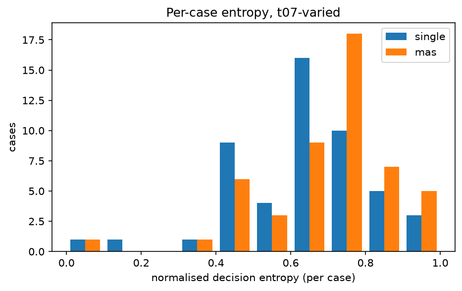
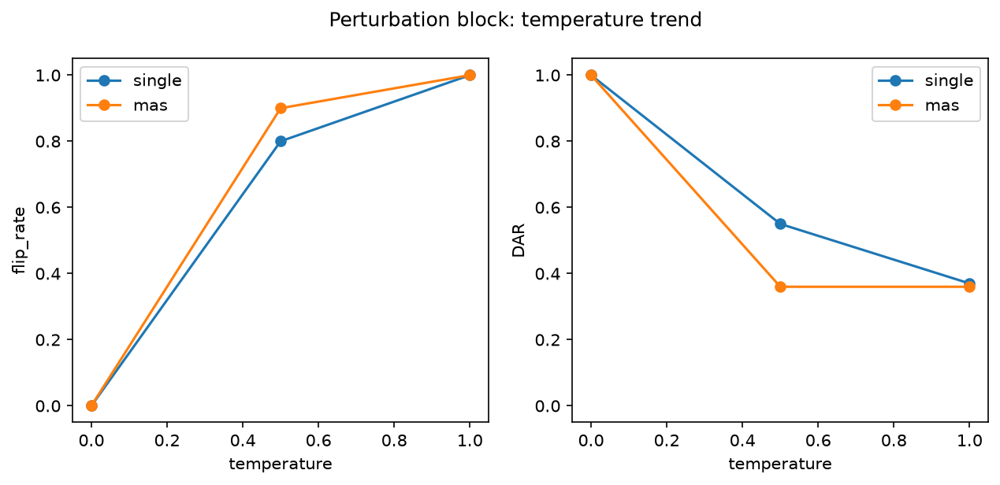

# Analysis report — PRD-A repeatability experiment

Model `lfm2.5:8b` (9cf756159fc2f3b9128…), Ollama 0.32.9, config hash `6a8531923a59`.
Journal lines: single=1150, mas=1150; planned total 2300.

pass^k is agreement with the benchmark authors' labels, not 'correctness'. Malformed outputs are included in every metric as an outcome category: they never match a label (pass^k, majority vote) and never match a real decision, but two malformed outputs count as agreeing with each other in DAR/alpha/entropy (category equality). Majority-vote ties break by canonical outcome order (escalate > dismiss > investigate > malformed).

## Headline: Tier 1 (primary conditions)

| arm | condition | cases | repeats | pass^1 | pass^5 | pass^15 | DAR | krippendorff_alpha | flip_rate |
|---|---|---|---|---|---|---|---|---|---|
| single | t0-fixed | 50 | 5 | 0.520 | 0.520 | — | 1.000 | 1.000 | 0.000 |
| single | t07-varied | 50 | 15 | 0.491 | 0.065 | 0.020 | 0.434 | 0.159 | 0.980 |
| mas | t0-fixed | 50 | 5 | 0.480 | 0.480 | — | 1.000 | 1.000 | 0.000 |
| mas | t07-varied | 50 | 15 | 0.344 | 0.047 | 0.020 | 0.421 | 0.130 | 0.980 |

## Tier 2

| arm | condition | cases | repeats | majority_vote_accuracy | mean_entropy | TAR | jaccard | nLCS | malformed_rate |
|---|---|---|---|---|---|---|---|---|---|
| single | t0-fixed | 50 | 5 | 0.520 | 0.000 | 1.000 | 1.000 | 1.000 | 0.020 |
| single | t07-varied | 50 | 15 | 0.680 | 0.643 | 0.087 | 0.463 | 0.430 | 0.044 |
| mas | t0-fixed | 50 | 5 | 0.480 | 0.000 | 0.992 | 0.998 | 0.995 | 0.060 |
| mas | t07-varied | 50 | 15 | 0.360 | 0.691 | 0.044 | 0.713 | 0.575 | 0.107 |

## Cost (Tier 3)

| arm | condition | cases | repeats | tokens_per_run | tokens_per_pass^1 | tokens_per_pass^5 | tokens_per_pass^15 | mean_wall_clock_s |
|---|---|---|---|---|---|---|---|---|
| single | t0-fixed | 50 | 5 | 4761.660 | 9157.038 | 9157.038 | — | 6.625 |
| single | t07-varied | 50 | 15 | 4331.528 | 8827.842 | 66671.341 | 216576.400 | 6.660 |
| mas | t0-fixed | 50 | 5 | 10269.952 | 21395.733 | 21395.733 | — | 19.437 |
| mas | t07-varied | 50 | 15 | 10028.996 | 29154.058 | 213293.732 | 501449.800 | 19.396 |

## Perturbation block (instrument check)

| arm | condition | cases | repeats | pass^1 | pass^5 | pass^15 | DAR | krippendorff_alpha | flip_rate | mean_entropy |
|---|---|---|---|---|---|---|---|---|---|---|
| single | pert-t0 | 10 | 5 | 0.600 | 0.600 | — | 1.000 | 1.000 | 0.000 | 0.000 |
| single | pert-t05 | 10 | 5 | 0.520 | 0.200 | — | 0.550 | 0.317 | 0.800 | 0.399 |
| single | pert-t10 | 10 | 5 | 0.480 | 0.000 | — | 0.370 | 0.078 | 1.000 | 0.588 |
| mas | pert-t0 | 10 | 5 | 0.100 | 0.100 | — | 1.000 | 1.000 | 0.000 | 0.000 |
| mas | pert-t05 | 10 | 5 | 0.280 | 0.000 | — | 0.360 | 0.085 | 0.900 | 0.612 |
| mas | pert-t10 | 10 | 5 | 0.260 | 0.000 | — | 0.360 | -0.025 | 1.000 | 0.611 |

## Appendix: lexical consistency (ROUGE-L)

| arm | condition | cases | repeats | rouge_l_f1 |
|---|---|---|---|---|
| single | t0-fixed | 50 | 5 | 1.000 |
| single | t07-varied | 50 | 15 | 0.308 |
| single | pert-t0 | 10 | 5 | 1.000 |
| single | pert-t05 | 10 | 5 | 0.255 |
| single | pert-t10 | 10 | 5 | 0.204 |
| mas | t0-fixed | 50 | 5 | 0.997 |
| mas | t07-varied | 50 | 15 | 0.328 |
| mas | pert-t0 | 10 | 5 | 1.000 |
| mas | pert-t05 | 10 | 5 | 0.349 |
| mas | pert-t10 | 10 | 5 | 0.321 |

rouge_l_f1 is the mean pairwise ROUGE-L F1 of the FULL raw output text across repeats (lowercased, whitespace tokens): surface-form overlap only, distinct from the decision-level and trajectory-level metrics above, and never part of the Tier 1 winner criterion.

## Arm difference (single − mas), t07-varied, per-case paired

| metric | mean diff | bootstrap 95% CI | permutation p |
|---|---|---|---|
| pass_fraction | 0.147 | [0.071, 0.220] | 0.001 |
| DAR | 0.013 | [-0.029, 0.056] | 0.578 |
| entropy | -0.049 | [-0.110, 0.012] | 0.129 |

Worst-entropy cases (single, t07-varied): TXN-2025-016, TXN-2025-045, TXN-2025-013
Worst-entropy cases (mas, t07-varied): TXN-2025-030, TXN-2025-041, TXN-2025-001

## Figures

