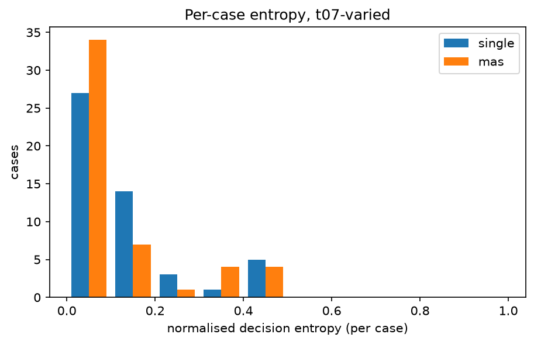
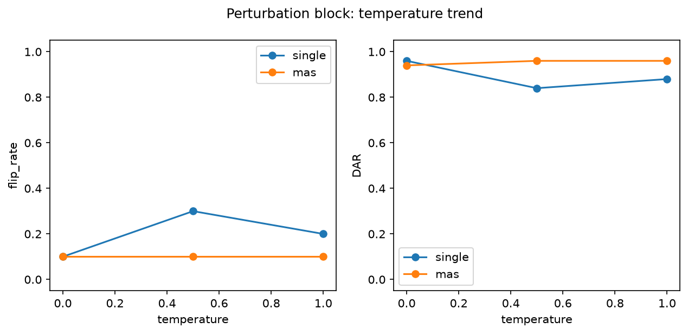

# Analysis report — PRD-A repeatability experiment

Model `qwen2.5:14b-instruct` (7cdf5a0187d5c58cc5d…), Ollama 0.31.1, config hash `cd15cc711f7b`.
Journal lines: single=1150, mas=1150; planned total 2300.

pass^k is agreement with the benchmark authors' labels, not 'correctness'. Malformed outputs are included in every metric as an outcome category: they never match a label (pass^k, majority vote) and never match a real decision, but two malformed outputs count as agreeing with each other in DAR/alpha/entropy (category equality). Majority-vote ties break by first-observed decision.

## Headline: Tier 1 (primary conditions)

| arm | condition | cases | repeats | pass^1 | pass^5 | pass^15 | DAR | krippendorff_alpha | flip_rate |
|---|---|---|---|---|---|---|---|---|---|
| single | t0-fixed | 50 | 5 | 0.188 | 0.160 | — | 0.968 | 0.884 | 0.080 |
| single | t07-varied | 50 | 15 | 0.248 | 0.149 | 0.060 | 0.893 | 0.382 | 0.460 |
| mas | t0-fixed | 50 | 5 | 0.232 | 0.220 | — | 0.976 | 0.758 | 0.060 |
| mas | t07-varied | 50 | 15 | 0.221 | 0.145 | 0.100 | 0.914 | 0.340 | 0.320 |

## Tier 2

| arm | condition | cases | repeats | majority_vote_accuracy | mean_entropy | TAR | jaccard | nLCS | malformed_rate |
|---|---|---|---|---|---|---|---|---|---|
| single | t0-fixed | 50 | 5 | 0.180 | 0.029 | 0.928 | 0.980 | 0.975 | 0.000 |
| single | t07-varied | 50 | 15 | 0.220 | 0.121 | 0.245 | 0.827 | 0.701 | 0.003 |
| mas | t0-fixed | 50 | 5 | 0.220 | 0.022 | 0.774 | 1.000 | 0.958 | 0.000 |
| mas | t07-varied | 50 | 15 | 0.220 | 0.094 | 0.177 | 0.985 | 0.778 | 0.003 |

## Cost (Tier 3)

| arm | condition | cases | repeats | tokens_per_run | tokens_per_pass^1 | tokens_per_pass^5 | tokens_per_pass^15 | mean_wall_clock_s |
|---|---|---|---|---|---|---|---|---|
| single | t0-fixed | 50 | 5 | 2137.692 | 11370.702 | 13360.575 | — | 6.595 |
| single | t07-varied | 50 | 15 | 2128.419 | 8582.333 | 14264.509 | 35473.644 | 7.470 |
| mas | t0-fixed | 50 | 5 | 5833.160 | 25142.931 | 26514.364 | — | 21.404 |
| mas | t07-varied | 50 | 15 | 5903.395 | 26671.964 | 40637.938 | 59033.947 | 16.394 |

## Perturbation block (instrument check)

| arm | condition | cases | repeats | pass^1 | pass^5 | pass^15 | DAR | krippendorff_alpha | flip_rate | mean_entropy |
|---|---|---|---|---|---|---|---|---|---|---|
| single | pert-t0 | 10 | 5 | 0.080 | 0.000 | — | 0.960 | 0.734 | 0.100 | 0.036 |
| single | pert-t05 | 10 | 5 | 0.060 | 0.000 | — | 0.840 | 0.129 | 0.300 | 0.133 |
| single | pert-t10 | 10 | 5 | 0.020 | 0.000 | — | 0.880 | 0.218 | 0.200 | 0.112 |
| mas | pert-t0 | 10 | 5 | 0.000 | 0.000 | — | 0.940 | 0.479 | 0.100 | 0.049 |
| mas | pert-t05 | 10 | 5 | 0.000 | 0.000 | — | 0.960 | 0.000 | 0.100 | 0.036 |
| mas | pert-t10 | 10 | 5 | 0.000 | 0.000 | — | 0.960 | 0.000 | 0.100 | 0.036 |

## Appendix: lexical consistency (ROUGE-L)

| arm | condition | cases | repeats | rouge_l_f1 |
|---|---|---|---|---|
| single | t0-fixed | 50 | 5 | 0.824 |
| single | t07-varied | 50 | 15 | 0.251 |
| single | pert-t0 | 10 | 5 | 0.841 |
| single | pert-t05 | 10 | 5 | 0.265 |
| single | pert-t10 | 10 | 5 | 0.222 |
| mas | t0-fixed | 50 | 5 | 0.600 |
| mas | t07-varied | 50 | 15 | 0.306 |
| mas | pert-t0 | 10 | 5 | 0.602 |
| mas | pert-t05 | 10 | 5 | 0.357 |
| mas | pert-t10 | 10 | 5 | 0.289 |

rouge_l_f1 is the mean pairwise ROUGE-L F1 of the FULL raw output text across repeats (lowercased, whitespace tokens): surface-form overlap only, distinct from the decision-level and trajectory-level metrics above, and never part of the Tier 1 winner criterion.

## Arm difference (single − mas), t07-varied, per-case paired

| metric | mean diff | bootstrap 95% CI | permutation p |
|---|---|---|---|
| pass_fraction | 0.027 | [-0.012, 0.076] | 0.307 |
| DAR | -0.021 | [-0.064, 0.023] | 0.370 |
| entropy | 0.027 | [-0.019, 0.074] | 0.258 |

Worst-entropy cases (single, t07-varied): TXN-2025-006, TXN-2025-019, TXN-2025-039
Worst-entropy cases (mas, t07-varied): TXN-2025-006, TXN-2025-017, TXN-2025-019

## Figures

