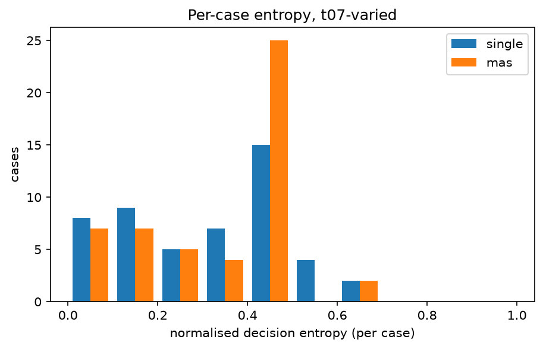
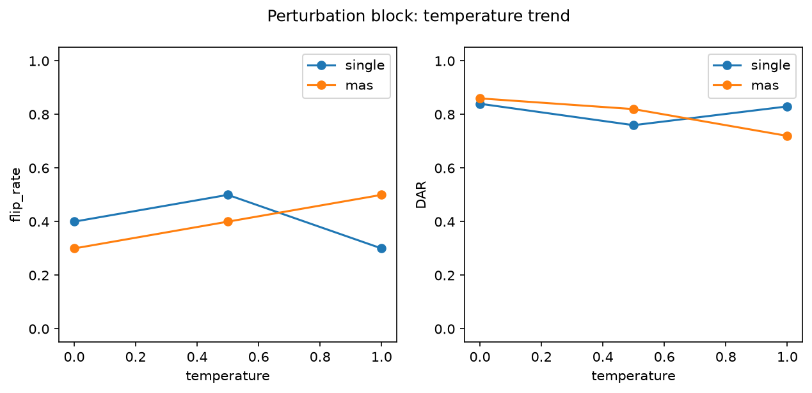

# Analysis report — PRD-A repeatability experiment

Model `qwen2.5:7b-instruct` (845dbda0ea48ed749ca…), Ollama 0.32.6, config hash `cdda53552e06`.
Journal lines: single=1150, mas=1150; planned total 2300.

pass^k is agreement with the benchmark authors' labels, not 'correctness'. Malformed outputs are included in every metric as an outcome category: they never match a label (pass^k, majority vote) and never match a real decision, but two malformed outputs count as agreeing with each other in DAR/alpha/entropy (category equality). Majority-vote ties break by first-observed decision.

## Headline: Tier 1 (primary conditions)

| arm | condition | cases | repeats | pass^1 | pass^5 | pass^15 | DAR | krippendorff_alpha | flip_rate |
|---|---|---|---|---|---|---|---|---|---|
| single | t0-fixed | 50 | 5 | 0.244 | 0.220 | — | 0.952 | 0.783 | 0.120 |
| single | t07-varied | 50 | 15 | 0.299 | 0.095 | 0.020 | 0.715 | 0.106 | 0.840 |
| mas | t0-fixed | 50 | 5 | 0.380 | 0.200 | — | 0.804 | 0.528 | 0.420 |
| mas | t07-varied | 50 | 15 | 0.456 | 0.139 | 0.040 | 0.661 | 0.276 | 0.860 |

## Tier 2

| arm | condition | cases | repeats | majority_vote_accuracy | mean_entropy | TAR | jaccard | nLCS | malformed_rate |
|---|---|---|---|---|---|---|---|---|---|
| single | t0-fixed | 50 | 5 | 0.240 | 0.043 | 0.968 | 0.991 | 0.989 | 0.016 |
| single | t07-varied | 50 | 15 | 0.200 | 0.313 | 0.507 | 0.842 | 0.794 | 0.011 |
| mas | t0-fixed | 50 | 5 | 0.360 | 0.169 | 0.672 | 1.000 | 0.891 | 0.000 |
| mas | t07-varied | 50 | 15 | 0.560 | 0.345 | 0.121 | 1.000 | 0.630 | 0.003 |

## Cost (Tier 3)

| arm | condition | cases | repeats | tokens_per_run | tokens_per_pass^1 | tokens_per_pass^5 | tokens_per_pass^15 | mean_wall_clock_s |
|---|---|---|---|---|---|---|---|---|
| single | t0-fixed | 50 | 5 | 2099.024 | 8602.557 | 9541.018 | — | 2.697 |
| single | t07-varied | 50 | 15 | 2085.689 | 6983.335 | 21855.416 | 104284.467 | 2.681 |
| mas | t0-fixed | 50 | 5 | 6084.436 | 16011.674 | 30422.180 | — | 11.382 |
| mas | t07-varied | 50 | 15 | 6469.217 | 14186.880 | 46409.603 | 161730.433 | 9.991 |

## Perturbation block (instrument check)

| arm | condition | cases | repeats | pass^1 | pass^5 | pass^15 | DAR | krippendorff_alpha | flip_rate | mean_entropy |
|---|---|---|---|---|---|---|---|---|---|---|
| single | pert-t0 | 10 | 5 | 0.020 | 0.000 | — | 0.840 | 0.510 | 0.400 | 0.144 |
| single | pert-t05 | 10 | 5 | 0.120 | 0.000 | — | 0.760 | 0.425 | 0.500 | 0.205 |
| single | pert-t10 | 10 | 5 | 0.020 | 0.000 | — | 0.830 | 0.091 | 0.300 | 0.153 |
| mas | pert-t0 | 10 | 5 | 0.120 | 0.100 | — | 0.860 | 0.660 | 0.300 | 0.121 |
| mas | pert-t05 | 10 | 5 | 0.080 | 0.000 | — | 0.820 | 0.574 | 0.400 | 0.157 |
| mas | pert-t10 | 10 | 5 | 0.160 | 0.100 | — | 0.720 | 0.347 | 0.500 | 0.230 |

## Appendix: lexical consistency (ROUGE-L)

| arm | condition | cases | repeats | rouge_l_f1 |
|---|---|---|---|---|
| single | t0-fixed | 50 | 5 | 0.863 |
| single | t07-varied | 50 | 15 | 0.300 |
| single | pert-t0 | 10 | 5 | 0.825 |
| single | pert-t05 | 10 | 5 | 0.367 |
| single | pert-t10 | 10 | 5 | 0.275 |
| mas | t0-fixed | 50 | 5 | 0.571 |
| mas | t07-varied | 50 | 15 | 0.285 |
| mas | pert-t0 | 10 | 5 | 0.493 |
| mas | pert-t05 | 10 | 5 | 0.315 |
| mas | pert-t10 | 10 | 5 | 0.311 |

rouge_l_f1 is the mean pairwise ROUGE-L F1 of the FULL raw output text across repeats (lowercased, whitespace tokens): surface-form overlap only, distinct from the decision-level and trajectory-level metrics above, and never part of the Tier 1 winner criterion.

## Arm difference (single − mas), t07-varied, per-case paired

| metric | mean diff | bootstrap 95% CI | permutation p |
|---|---|---|---|
| pass_fraction | -0.157 | [-0.227, -0.091] | 0.000 |
| DAR | 0.054 | [-0.004, 0.111] | 0.070 |
| entropy | -0.032 | [-0.091, 0.027] | 0.291 |

Worst-entropy cases (single, t07-varied): TXN-2025-004, TXN-2025-036, TXN-2025-006
Worst-entropy cases (mas, t07-varied): TXN-2025-032, TXN-2025-030, TXN-2025-002

## Figures

