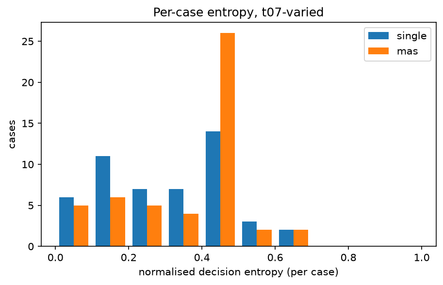
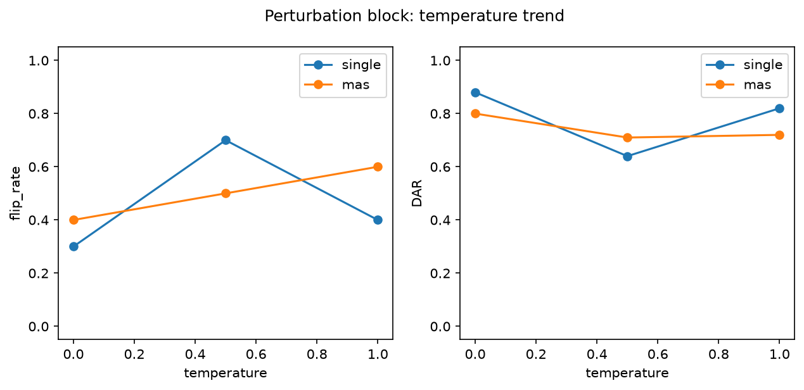

# Analysis report — PRD-A repeatability experiment

Model `qwen2.5:7b-instruct` (845dbda0ea48ed749ca…), Ollama 0.31.1, config hash `cdda53552e06`.
Journal lines: single=1150, mas=1150; planned total 2300.

pass^k is agreement with the benchmark authors' labels, not 'correctness'. Malformed outputs are included in every metric as an outcome category: they never match a label (pass^k, majority vote) and never match a real decision, but two malformed outputs count as agreeing with each other in DAR/alpha/entropy (category equality). Majority-vote ties break by first-observed decision.

## Headline: Tier 1 (primary conditions)

| arm | condition | cases | repeats | pass^1 | pass^5 | pass^15 | DAR | krippendorff_alpha | flip_rate |
|---|---|---|---|---|---|---|---|---|---|
| single | t0-fixed | 50 | 5 | 0.244 | 0.220 | — | 0.952 | 0.783 | 0.120 |
| single | t07-varied | 50 | 15 | 0.293 | 0.089 | 0.000 | 0.719 | 0.102 | 0.880 |
| mas | t0-fixed | 50 | 5 | 0.380 | 0.200 | — | 0.824 | 0.576 | 0.380 |
| mas | t07-varied | 50 | 15 | 0.449 | 0.107 | 0.020 | 0.647 | 0.279 | 0.900 |

## Tier 2

| arm | condition | cases | repeats | majority_vote_accuracy | mean_entropy | TAR | jaccard | nLCS | malformed_rate |
|---|---|---|---|---|---|---|---|---|---|
| single | t0-fixed | 50 | 5 | 0.240 | 0.043 | 0.968 | 0.991 | 0.989 | 0.016 |
| single | t07-varied | 50 | 15 | 0.200 | 0.312 | 0.505 | 0.841 | 0.794 | 0.011 |
| mas | t0-fixed | 50 | 5 | 0.380 | 0.152 | 0.672 | 1.000 | 0.888 | 0.000 |
| mas | t07-varied | 50 | 15 | 0.540 | 0.364 | 0.105 | 0.999 | 0.638 | 0.005 |

## Cost (Tier 3)

| arm | condition | cases | repeats | tokens_per_run | tokens_per_pass^1 | tokens_per_pass^5 | tokens_per_pass^15 | mean_wall_clock_s |
|---|---|---|---|---|---|---|---|---|
| single | t0-fixed | 50 | 5 | 2099.024 | 8602.557 | 9541.018 | — | 2.638 |
| single | t07-varied | 50 | 15 | 2073.595 | 7069.073 | 23360.612 | — | 2.589 |
| mas | t0-fixed | 50 | 5 | 6028.236 | 15863.779 | 30141.180 | — | 10.980 |
| mas | t07-varied | 50 | 15 | 6458.193 | 14372.834 | 60432.365 | 322909.667 | 9.438 |

## Perturbation block (instrument check)

| arm | condition | cases | repeats | pass^1 | pass^5 | pass^15 | DAR | krippendorff_alpha | flip_rate | mean_entropy |
|---|---|---|---|---|---|---|---|---|---|---|
| single | pert-t0 | 10 | 5 | 0.080 | 0.000 | — | 0.880 | 0.443 | 0.300 | 0.108 |
| single | pert-t05 | 10 | 5 | 0.120 | 0.000 | — | 0.640 | 0.254 | 0.700 | 0.302 |
| single | pert-t10 | 10 | 5 | 0.060 | 0.000 | — | 0.820 | 0.189 | 0.400 | 0.157 |
| mas | pert-t0 | 10 | 5 | 0.100 | 0.100 | — | 0.800 | 0.575 | 0.400 | 0.169 |
| mas | pert-t05 | 10 | 5 | 0.060 | 0.000 | — | 0.710 | 0.239 | 0.500 | 0.250 |
| mas | pert-t10 | 10 | 5 | 0.120 | 0.000 | — | 0.720 | 0.304 | 0.600 | 0.241 |

## Appendix: lexical consistency (ROUGE-L)

| arm | condition | cases | repeats | rouge_l_f1 |
|---|---|---|---|---|
| single | t0-fixed | 50 | 5 | 0.863 |
| single | t07-varied | 50 | 15 | 0.301 |
| single | pert-t0 | 10 | 5 | 0.843 |
| single | pert-t05 | 10 | 5 | 0.332 |
| single | pert-t10 | 10 | 5 | 0.284 |
| mas | t0-fixed | 50 | 5 | 0.576 |
| mas | t07-varied | 50 | 15 | 0.286 |
| mas | pert-t0 | 10 | 5 | 0.516 |
| mas | pert-t05 | 10 | 5 | 0.354 |
| mas | pert-t10 | 10 | 5 | 0.282 |

rouge_l_f1 is the mean pairwise ROUGE-L F1 of the FULL raw output text across repeats (lowercased, whitespace tokens): surface-form overlap only, distinct from the decision-level and trajectory-level metrics above, and never part of the Tier 1 winner criterion.

## Arm difference (single − mas), t07-varied, per-case paired

| metric | mean diff | bootstrap 95% CI | permutation p |
|---|---|---|---|
| pass_fraction | -0.156 | [-0.232, -0.081] | 0.000 |
| DAR | 0.072 | [0.011, 0.130] | 0.024 |
| entropy | -0.052 | [-0.110, 0.009] | 0.101 |

Worst-entropy cases (single, t07-varied): TXN-2025-004, TXN-2025-036, TXN-2025-006
Worst-entropy cases (mas, t07-varied): TXN-2025-003, TXN-2025-013, TXN-2025-006

## Figures

