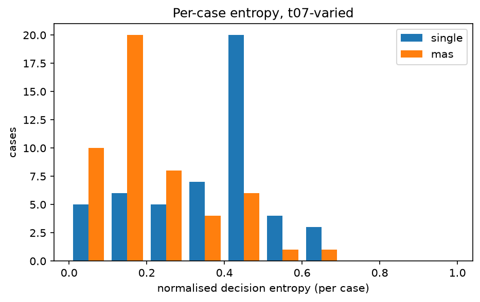
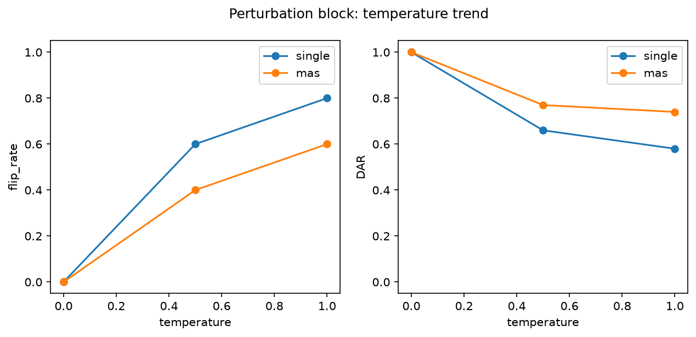

# Analysis report — PRD-A repeatability experiment

Model `qwen3.5:9b` (6488c96fa5faab64bb6…), Ollama 0.32.6, config hash `76337b11ca1c`.
Journal lines: single=1150, mas=1150; planned total 2300.

pass^k is agreement with the benchmark authors' labels, not 'correctness'. Malformed outputs are included in every metric as an outcome category: they never match a label (pass^k, majority vote) and never match a real decision, but two malformed outputs count as agreeing with each other in DAR/alpha/entropy (category equality). Majority-vote ties break by first-observed decision.

## Headline: Tier 1 (primary conditions)

| arm | condition | cases | repeats | pass^1 | pass^5 | pass^15 | DAR | krippendorff_alpha | flip_rate |
|---|---|---|---|---|---|---|---|---|---|
| single | t0-fixed | 50 | 5 | 0.300 | 0.300 | — | 1.000 | 1.000 | 0.000 |
| single | t07-varied | 50 | 15 | 0.339 | 0.079 | 0.040 | 0.655 | 0.241 | 0.900 |
| mas | t0-fixed | 50 | 5 | 0.300 | 0.300 | — | 1.000 | 1.000 | 0.000 |
| mas | t07-varied | 50 | 15 | 0.255 | 0.108 | 0.040 | 0.809 | 0.191 | 0.800 |

## Tier 2

| arm | condition | cases | repeats | majority_vote_accuracy | mean_entropy | TAR | jaccard | nLCS | malformed_rate |
|---|---|---|---|---|---|---|---|---|---|
| single | t0-fixed | 50 | 5 | 0.300 | 0.000 | 1.000 | 1.000 | 1.000 | 0.000 |
| single | t07-varied | 50 | 15 | 0.300 | 0.368 | 0.153 | 0.713 | 0.616 | 0.004 |
| mas | t0-fixed | 50 | 5 | 0.300 | 0.000 | 1.000 | 1.000 | 1.000 | 0.000 |
| mas | t07-varied | 50 | 15 | 0.220 | 0.223 | 0.414 | 0.955 | 0.848 | 0.000 |

## Cost (Tier 3)

| arm | condition | cases | repeats | tokens_per_run | tokens_per_pass^1 | tokens_per_pass^5 | tokens_per_pass^15 | mean_wall_clock_s |
|---|---|---|---|---|---|---|---|---|
| single | t0-fixed | 50 | 5 | 4384.440 | 14614.800 | 14614.800 | — | 6.564 |
| single | t07-varied | 50 | 15 | 4271.787 | 12613.543 | 54072.565 | 106794.667 | 6.459 |
| mas | t0-fixed | 50 | 5 | 7492.020 | 24973.400 | 24973.400 | — | 19.531 |
| mas | t07-varied | 50 | 15 | 7761.105 | 30475.545 | 71642.073 | 194027.633 | 18.270 |

## Perturbation block (instrument check)

| arm | condition | cases | repeats | pass^1 | pass^5 | pass^15 | DAR | krippendorff_alpha | flip_rate | mean_entropy |
|---|---|---|---|---|---|---|---|---|---|---|
| single | pert-t0 | 10 | 5 | 0.400 | 0.400 | — | 1.000 | 1.000 | 0.000 | 0.000 |
| single | pert-t05 | 10 | 5 | 0.280 | 0.100 | — | 0.660 | 0.383 | 0.600 | 0.279 |
| single | pert-t10 | 10 | 5 | 0.240 | 0.100 | — | 0.580 | 0.212 | 0.800 | 0.394 |
| mas | pert-t0 | 10 | 5 | 0.000 | 0.000 | — | 1.000 | 1.000 | 0.000 | 0.000 |
| mas | pert-t05 | 10 | 5 | 0.100 | 0.000 | — | 0.770 | 0.179 | 0.400 | 0.202 |
| mas | pert-t10 | 10 | 5 | 0.120 | 0.000 | — | 0.740 | 0.234 | 0.600 | 0.229 |

## Appendix: lexical consistency (ROUGE-L)

| arm | condition | cases | repeats | rouge_l_f1 |
|---|---|---|---|---|
| single | t0-fixed | 50 | 5 | 1.000 |
| single | t07-varied | 50 | 15 | 0.211 |
| single | pert-t0 | 10 | 5 | 1.000 |
| single | pert-t05 | 10 | 5 | 0.237 |
| single | pert-t10 | 10 | 5 | 0.193 |
| mas | t0-fixed | 50 | 5 | 1.000 |
| mas | t07-varied | 50 | 15 | 0.244 |
| mas | pert-t0 | 10 | 5 | 1.000 |
| mas | pert-t05 | 10 | 5 | 0.255 |
| mas | pert-t10 | 10 | 5 | 0.222 |

rouge_l_f1 is the mean pairwise ROUGE-L F1 of the FULL raw output text across repeats (lowercased, whitespace tokens): surface-form overlap only, distinct from the decision-level and trajectory-level metrics above, and never part of the Tier 1 winner criterion.

## Arm difference (single − mas), t07-varied, per-case paired

| metric | mean diff | bootstrap 95% CI | permutation p |
|---|---|---|---|
| pass_fraction | 0.084 | [0.019, 0.153] | 0.021 |
| DAR | -0.154 | [-0.208, -0.095] | 0.000 |
| entropy | 0.145 | [0.084, 0.202] | 0.000 |

Worst-entropy cases (single, t07-varied): TXN-2025-019, TXN-2025-010, TXN-2025-048
Worst-entropy cases (mas, t07-varied): TXN-2025-023, TXN-2025-004, TXN-2025-006

## Figures

