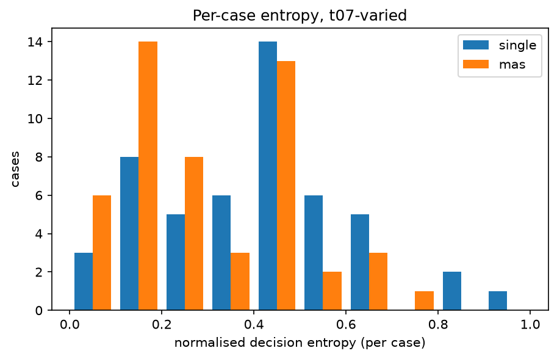
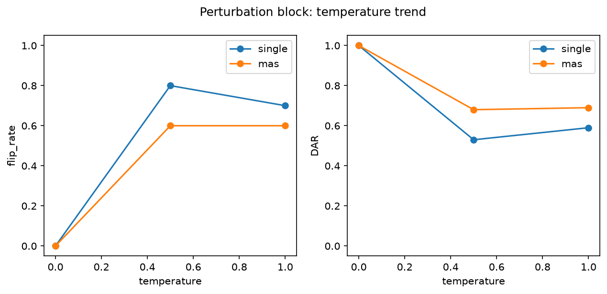

# Analysis report — PRD-A repeatability experiment

Model `qwen3.5:9b` (6488c96fa5faab64bb6…), Ollama 0.32.9, config hash `15ca01ae0e69`.
Journal lines: single=1150, mas=1150; planned total 2300.

pass^k is agreement with the benchmark authors' labels, not 'correctness'. Malformed outputs are included in every metric as an outcome category: they never match a label (pass^k, majority vote) and never match a real decision, but two malformed outputs count as agreeing with each other in DAR/alpha/entropy (category equality). Majority-vote ties break by canonical outcome order (escalate > dismiss > investigate > malformed).

## Headline: Tier 1 (primary conditions)

| arm | condition | cases | repeats | pass^1 | pass^5 | pass^15 | DAR | krippendorff_alpha | flip_rate |
|---|---|---|---|---|---|---|---|---|---|
| single | t0-fixed | 50 | 5 | 0.560 | 0.560 | — | 1.000 | 1.000 | 0.000 |
| single | t07-varied | 50 | 15 | 0.548 | 0.177 | 0.020 | 0.631 | 0.413 | 0.940 |
| mas | t0-fixed | 50 | 5 | 0.260 | 0.260 | — | 1.000 | 1.000 | 0.000 |
| mas | t07-varied | 50 | 15 | 0.264 | 0.067 | 0.000 | 0.724 | 0.277 | 0.880 |

## Tier 2

| arm | condition | cases | repeats | majority_vote_accuracy | mean_entropy | TAR | jaccard | nLCS | malformed_rate |
|---|---|---|---|---|---|---|---|---|---|
| single | t0-fixed | 50 | 5 | 0.560 | 0.000 | 1.000 | 1.000 | 1.000 | 0.000 |
| single | t07-varied | 50 | 15 | 0.640 | 0.411 | 0.096 | 0.767 | 0.610 | 0.019 |
| mas | t0-fixed | 50 | 5 | 0.260 | 0.000 | 0.992 | 0.997 | 0.999 | 0.000 |
| mas | t07-varied | 50 | 15 | 0.220 | 0.308 | 0.100 | 0.709 | 0.578 | 0.017 |

## Cost (Tier 3)

| arm | condition | cases | repeats | tokens_per_run | tokens_per_pass^1 | tokens_per_pass^5 | tokens_per_pass^15 | mean_wall_clock_s |
|---|---|---|---|---|---|---|---|---|
| single | t0-fixed | 50 | 5 | 9091.780 | 16235.321 | 16235.321 | — | 27.639 |
| single | t07-varied | 50 | 15 | 9550.208 | 17427.387 | 54085.306 | 477510.400 | 28.120 |
| mas | t0-fixed | 50 | 5 | 15284.088 | 58784.954 | 58784.954 | — | 87.047 |
| mas | t07-varied | 50 | 15 | 17318.036 | 65598.621 | 256946.947 | — | 75.596 |

## Perturbation block (instrument check)

| arm | condition | cases | repeats | pass^1 | pass^5 | pass^15 | DAR | krippendorff_alpha | flip_rate | mean_entropy |
|---|---|---|---|---|---|---|---|---|---|---|
| single | pert-t0 | 10 | 5 | 0.600 | 0.600 | — | 1.000 | 1.000 | 0.000 | 0.000 |
| single | pert-t05 | 10 | 5 | 0.500 | 0.100 | — | 0.530 | 0.305 | 0.800 | 0.411 |
| single | pert-t10 | 10 | 5 | 0.540 | 0.200 | — | 0.590 | 0.406 | 0.700 | 0.378 |
| mas | pert-t0 | 10 | 5 | 0.200 | 0.200 | — | 1.000 | 1.000 | 0.000 | 0.000 |
| mas | pert-t05 | 10 | 5 | 0.180 | 0.100 | — | 0.680 | 0.299 | 0.600 | 0.281 |
| mas | pert-t10 | 10 | 5 | 0.120 | 0.000 | — | 0.690 | 0.295 | 0.600 | 0.289 |

## Appendix: lexical consistency (ROUGE-L)

| arm | condition | cases | repeats | rouge_l_f1 |
|---|---|---|---|---|
| single | t0-fixed | 50 | 5 | 1.000 |
| single | t07-varied | 50 | 15 | 0.194 |
| single | pert-t0 | 10 | 5 | 1.000 |
| single | pert-t05 | 10 | 5 | 0.188 |
| single | pert-t10 | 10 | 5 | 0.150 |
| mas | t0-fixed | 50 | 5 | 0.994 |
| mas | t07-varied | 50 | 15 | 0.229 |
| mas | pert-t0 | 10 | 5 | 1.000 |
| mas | pert-t05 | 10 | 5 | 0.249 |
| mas | pert-t10 | 10 | 5 | 0.207 |

rouge_l_f1 is the mean pairwise ROUGE-L F1 of the FULL raw output text across repeats (lowercased, whitespace tokens): surface-form overlap only, distinct from the decision-level and trajectory-level metrics above, and never part of the Tier 1 winner criterion.

## Arm difference (single − mas), t07-varied, per-case paired

| metric | mean diff | bootstrap 95% CI | permutation p |
|---|---|---|---|
| pass_fraction | 0.284 | [0.172, 0.396] | 0.000 |
| DAR | -0.093 | [-0.150, -0.037] | 0.002 |
| entropy | 0.102 | [0.044, 0.162] | 0.001 |

Worst-entropy cases (single, t07-varied): TXN-2025-010, TXN-2025-047, TXN-2025-001
Worst-entropy cases (mas, t07-varied): TXN-2025-001, TXN-2025-035, TXN-2025-033

## Figures

