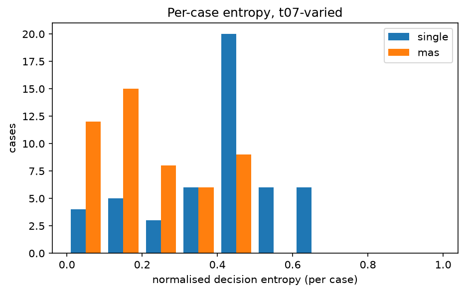
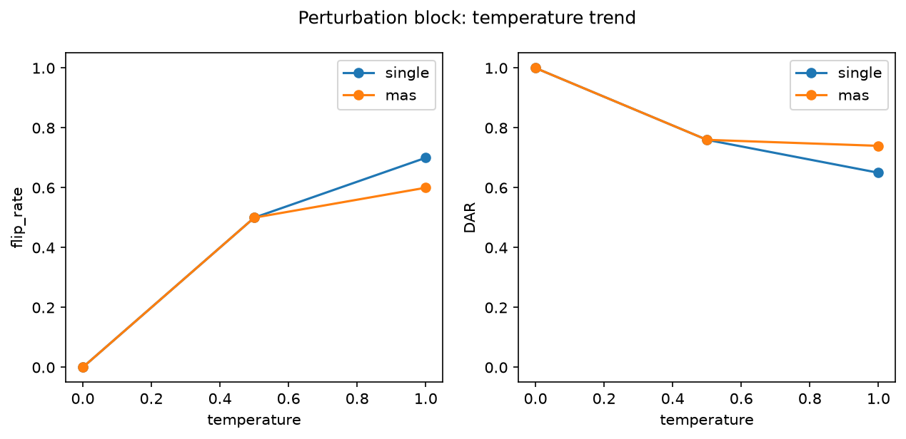

# Analysis report — PRD-A repeatability experiment

Model `qwen3.5:9b` (6488c96fa5faab64bb6…), Ollama 0.31.1, config hash `76337b11ca1c`.
Journal lines: single=1150, mas=1150; planned total 2300.

pass^k is agreement with the benchmark authors' labels, not 'correctness'. Malformed outputs are included in every metric.

## Headline: Tier 1 (primary conditions)

| arm | condition | cases | repeats | pass^1 | pass^5 | pass^15 | DAR | krippendorff_alpha | flip_rate |
|---|---|---|---|---|---|---|---|---|---|
| single | t0-fixed | 50 | 5 | 0.400 | 0.400 | — | 1.000 | 1.000 | 0.000 |
| single | t07-varied | 50 | 15 | 0.364 | 0.078 | 0.040 | 0.618 | 0.205 | 0.920 |
| mas | t0-fixed | 50 | 5 | 0.260 | 0.260 | — | 1.000 | 1.000 | 0.000 |
| mas | t07-varied | 50 | 15 | 0.253 | 0.110 | 0.060 | 0.802 | 0.203 | 0.760 |

## Tier 2

| arm | condition | cases | repeats | majority_vote_accuracy | mean_entropy | TAR | jaccard | nLCS | malformed_rate |
|---|---|---|---|---|---|---|---|---|---|
| single | t0-fixed | 50 | 5 | 0.400 | 0.000 | 1.000 | 1.000 | 1.000 | 0.000 |
| single | t07-varied | 50 | 15 | 0.360 | 0.409 | 0.155 | 0.709 | 0.618 | 0.004 |
| mas | t0-fixed | 50 | 5 | 0.260 | 0.000 | 1.000 | 1.000 | 1.000 | 0.000 |
| mas | t07-varied | 50 | 15 | 0.220 | 0.223 | 0.414 | 0.953 | 0.847 | 0.000 |

## Cost (Tier 3)

| arm | condition | cases | repeats | tokens_per_run | tokens_per_pass^1 | tokens_per_pass^5 | tokens_per_pass^15 | mean_wall_clock_s |
|---|---|---|---|---|---|---|---|---|
| single | t0-fixed | 50 | 5 | 4219.180 | 10547.950 | 10547.950 | — | 6.249 |
| single | t07-varied | 50 | 15 | 4241.443 | 11652.315 | 54241.770 | 106036.067 | 6.538 |
| mas | t0-fixed | 50 | 5 | 7501.360 | 28851.385 | 28851.385 | — | 19.736 |
| mas | t07-varied | 50 | 15 | 7759.716 | 30630.458 | 70459.685 | 129328.600 | 16.345 |

## Perturbation block (instrument check)

| arm | condition | cases | repeats | pass^1 | pass^5 | pass^15 | DAR | krippendorff_alpha | flip_rate | mean_entropy |
|---|---|---|---|---|---|---|---|---|---|---|
| single | pert-t0 | 10 | 5 | 0.300 | 0.300 | — | 1.000 | 1.000 | 0.000 | 0.000 |
| single | pert-t05 | 10 | 5 | 0.320 | 0.100 | — | 0.760 | 0.593 | 0.500 | 0.205 |
| single | pert-t10 | 10 | 5 | 0.240 | 0.000 | — | 0.650 | 0.335 | 0.700 | 0.310 |
| mas | pert-t0 | 10 | 5 | 0.000 | 0.000 | — | 1.000 | 1.000 | 0.000 | 0.000 |
| mas | pert-t05 | 10 | 5 | 0.080 | 0.000 | — | 0.760 | 0.055 | 0.500 | 0.205 |
| mas | pert-t10 | 10 | 5 | 0.180 | 0.100 | — | 0.740 | 0.302 | 0.600 | 0.229 |

## Appendix: lexical consistency (ROUGE-L)

| arm | condition | cases | repeats | rouge_l_f1 |
|---|---|---|---|---|
| single | t0-fixed | 50 | 5 | 1.000 |
| single | t07-varied | 50 | 15 | 0.210 |
| single | pert-t0 | 10 | 5 | 1.000 |
| single | pert-t05 | 10 | 5 | 0.247 |
| single | pert-t10 | 10 | 5 | 0.195 |
| mas | t0-fixed | 50 | 5 | 1.000 |
| mas | t07-varied | 50 | 15 | 0.244 |
| mas | pert-t0 | 10 | 5 | 1.000 |
| mas | pert-t05 | 10 | 5 | 0.251 |
| mas | pert-t10 | 10 | 5 | 0.213 |

rouge_l_f1 is the mean pairwise ROUGE-L F1 of the FULL raw output text across repeats (lowercased, whitespace tokens): surface-form overlap only, distinct from the decision-level and trajectory-level metrics above, and never part of the Tier 1 winner criterion.

## Arm difference (single − mas), t07-varied, per-case paired

| metric | mean diff | bootstrap 95% CI | permutation p |
|---|---|---|---|
| pass_fraction | 0.111 | [0.045, 0.180] | 0.003 |
| DAR | -0.184 | [-0.241, -0.127] | 0.000 |
| entropy | 0.185 | [0.125, 0.245] | 0.000 |

Worst-entropy cases (single, t07-varied): TXN-2025-044, TXN-2025-017, TXN-2025-048
Worst-entropy cases (mas, t07-varied): TXN-2025-006, TXN-2025-027, TXN-2025-008

## Figures

